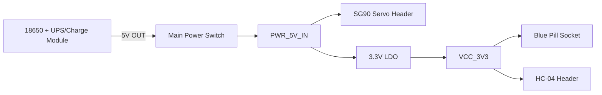

# Smart Lock Baseboard Schematic and BOM

## Scope

This document defines a first-pass smart lock baseboard for:

- `STM32F103C8T6 Blue Pill` minimum system board
- `HC-04` BLE UART module
- `SG90` servo
- External `18650 UPS/charge/boost module` mounted on the same PCB

Confirmed design choices:

- Blue Pill is plugged into the baseboard instead of placing the STM32 chip directly.
- The Taobao power module is mounted on the same PCB as a daughter module.
- The power module output version is `5V`.
- Recommended power architecture is:
  - `5V` directly powers the servo rail
  - `5V -> 3.3V LDO` powers Blue Pill and HC-04

## Power Architecture

### Net Names

Create these nets in EasyEDA:

- `PWR_5V_IN`
- `VCC_3V3`
- `GND`
- `SERVO_PWM`
- `BLE_TX`
- `BLE_RX`
- `DBG_TX`
- `DBG_RX`

### Functional Power Path

### Key Design Rules

- Do not power the servo from Blue Pill `5V`.
- Do not power HC-04 from `5V`.
- Feed Blue Pill through the `3V3` pin from the external LDO.
- Keep servo current on `PWR_5V_IN`; keep logic on `VCC_3V3`.
- All grounds must be common.
- Place the servo bulk capacitor next to the servo connector.
- Place the LDO and its capacitors between the power module output and Blue Pill/HC-04 load area.

## Schematic Blocks

### Block 1: External UPS/Charge Module Interface

Treat the purchased power module as `U1`.

Required electrical pins from `U1`:

- `U1.OUT+ -> SW1-1`
- `U1.OUT- -> GND`

After the switch:

- `SW1-2 -> PWR_5V_IN`

Notes:

- If the purchased module exposes `OUT+ / OUT-`, use those pads.
- If the purchased module exposes `5V / GND`, use those pads.
- Do not take power from raw battery terminals for the baseboard.
- Because the exact module footprint is not yet confirmed, reserve a configurable module area and define the final pad pattern after measuring the real board.

### Block 2: Servo Power and Connector

Use `J4` as the SG90 3-pin header.

Pin order:

1. `PWR_5V_IN`
2. `GND`
3. `SERVO_PWM`

Connections:

- `PWR_5V_IN -> J4-1`
- `GND -> J4-2`
- `PA8 -> R1 -> SERVO_PWM -> J4-3`

Recommended local capacitors:

- `C1 = 470uF to 1000uF / 10V`, between `PWR_5V_IN` and `GND`
- `C2 = 0.1uF`, between `PWR_5V_IN` and `GND`

Signal resistor:

- `R1 = 220R`

### Block 3: 3.3V Logic Power

Use `U2` as a dedicated `3.3V LDO`.

Recommended device:

- `ME6211C33M5G-N` or equivalent low-quiescent `3.3V` LDO

Connections:

- `PWR_5V_IN -> U2.IN`
- `GND -> U2.GND`
- `U2.OUT -> VCC_3V3`

Capacitors:

- `C3 = 10uF`, `U2.IN` to `GND`
- `C4 = 10uF`, `U2.OUT` to `GND`
- `C5 = 0.1uF`, `U2.OUT` to `GND`

If using another LDO, confirm its required output capacitor ESR and package pinout first.

### Block 4: Blue Pill Socket

Use two `1x20 2.54mm female headers` as `J1` and `J2`.

Minimum required Blue Pill connections:

- `Blue Pill 3V3 -> VCC_3V3`
- `Blue Pill GND -> GND`
- `Blue Pill PA8 -> SERVO_PWM`
- `Blue Pill PA2 -> BLE_TX`
- `Blue Pill PA3 -> BLE_RX`
- `Blue Pill PA9 -> DBG_TX`
- `Blue Pill PA10 -> DBG_RX`

Recommendation:

- Connect at least two Blue Pill ground pins to the ground plane.
- Do not inject `PWR_5V_IN` into the Blue Pill `5V` pin in this version.

### Block 5: HC-04 BLE Header

Use `J3` as a `1x4 2.54mm` header.

Pin order:

1. `VCC_3V3`
2. `GND`
3. `BLE_RX` from HC-04 `TXD`
4. `BLE_TX` to HC-04 `RXD`

Electrical mapping:

- `J3-1 -> VCC_3V3`
- `J3-2 -> GND`
- `J3-3 -> PA3`
- `J3-4 -> PA2`

Local capacitors:

- `C6 = 10uF`, between `VCC_3V3` and `GND`
- `C7 = 0.1uF`, between `VCC_3V3` and `GND`

### Block 6: Debug UART Header

Use `J5` as a `1x4 2.54mm` header.

Pin order:

1. `VCC_3V3`
2. `GND`
3. `DBG_TX`
4. `DBG_RX`

Electrical mapping:

- `J5-1 -> VCC_3V3`
- `J5-2 -> GND`
- `J5-3 -> PA9`
- `J5-4 -> PA10`

## Complete Connection Table

### Power Nets

- `U1.OUT+ -> SW1-1`
- `SW1-2 -> PWR_5V_IN`
- `U1.OUT- -> GND`
- `PWR_5V_IN -> J4-1`
- `PWR_5V_IN -> U2.IN`
- `PWR_5V_IN -> C1+`
- `PWR_5V_IN -> C2-1`
- `PWR_5V_IN -> C3+`
- `GND -> J4-2`
- `GND -> U2.GND`
- `GND -> C1-`
- `GND -> C2-2`
- `GND -> C3-`
- `GND -> C4-`
- `GND -> C5-`
- `GND -> C6-`
- `GND -> C7-`
- `VCC_3V3 -> U2.OUT`
- `VCC_3V3 -> Blue Pill 3V3`
- `VCC_3V3 -> J3-1`
- `VCC_3V3 -> J5-1`
- `VCC_3V3 -> C4+`
- `VCC_3V3 -> C5+`
- `VCC_3V3 -> C6+`
- `VCC_3V3 -> C7+`

### Signal Nets

- `Blue Pill PA8 -> R1-1`
- `R1-2 -> SERVO_PWM`
- `SERVO_PWM -> J4-3`
- `Blue Pill PA2 -> BLE_TX`
- `BLE_TX -> J3-4`
- `Blue Pill PA3 -> BLE_RX`
- `BLE_RX -> J3-3`
- `Blue Pill PA9 -> DBG_TX`
- `DBG_TX -> J5-3`
- `Blue Pill PA10 -> DBG_RX`
- `DBG_RX -> J5-4`

## Suggested Placement

- Put `U1` near the board edge for Type-C access.
- Put `SW1` close to the board edge for easy operation.
- Put `J4` and `C1` close together.
- Keep the `PWR_5V_IN` trace from `U1` to `J4` wide.
- Put `U2`, `C3`, `C4`, and `C5` together as a compact logic power island.
- Put `J3` away from the servo power loop and away from the boost switching area on `U1`.
- Keep the Blue Pill socket accessible for replacement and programming.

## PCB Routing Notes

- Recommended servo 5V trace width: at least `1.0mm`, wider if space allows.
- Use a solid ground plane on the bottom layer if possible.
- Do not route the servo current return through thin logic-only traces.
- Route `SERVO_PWM` away from the boost inductor area if possible.
- If the power module has a switching inductor, keep HC-04 antenna area away from that side.

## First-Pass BOM Notes

- The external Taobao UPS module is treated as a user-supplied module, not a PCB-assembled IC set.
- If low standby current matters, prefer `ME6211` over `AMS1117`.
- If SG90 startup causes reset in testing, increase `C1` from `470uF` to `1000uF`.
- If the purchased module output ripple is high, add another `47uF to 100uF` low-ESR capacitor on `PWR_5V_IN`.

## EasyEDA Drawing Order

1. Place `U1` module interface area
2. Place `SW1`
3. Place `J4`, `C1`, `C2`, and `R1`
4. Place `U2`, `C3`, `C4`, and `C5`
5. Place Blue Pill sockets `J1` and `J2`
6. Place `J3`, `C6`, and `C7`
7. Place `J5`
8. Add net labels
9. Run ERC and confirm no net naming mistakes

## Optional Additions for V2

- Add a `power LED` on `VCC_3V3`
- Add a `TVS diode` on the `5V` input rail
- Add a `door status switch` input
- Add a `tamper switch` input
- Add an `NRST` push button breakout
